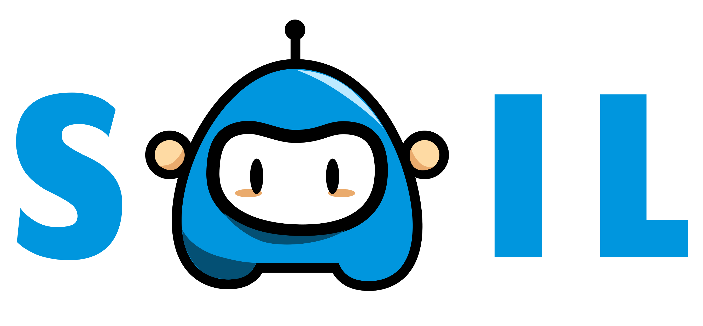

<p align="center">
    
    <br>
<p>

<h1 align="center">
    SAIL (Socratic Artificial Intelligence Learning)
</h1>

<h3 align="center">
    A medical education tool based on natural language interactions.
</h3>


## Installation and Running

NOTE: This repo does not contain any user data from the study. So upon logging in, only the `demo` user will be available. To request data files from the study, please contact me at sslocum3@mit.edu.

Clone the repository: `$ git clone https://github.com/stewy33/SAIL`

Navigate into the directory: `$ cd SAIL`


On the first run or after changing the question files, retrain the scoring model:
```bash
$ cd backend/scoring
$ python score.py
```

Run the scoring server:
```bash
$ cd backend/scoring
$ python server.py
```

In another shell, run the nodejs backend:
```bash
$ npm run server
```

In another shell, from the repository's root directory, run the frontend:

```bash
$ npm run frontend
```

Now navigate to the url printed in the terminal (usually `localhost:8081`) to view the app. Log in with the username `demo` to begin testing.

If you're trying to run this code and have any questions, please feel free to reach out to me at sslocum3@mit.edu.